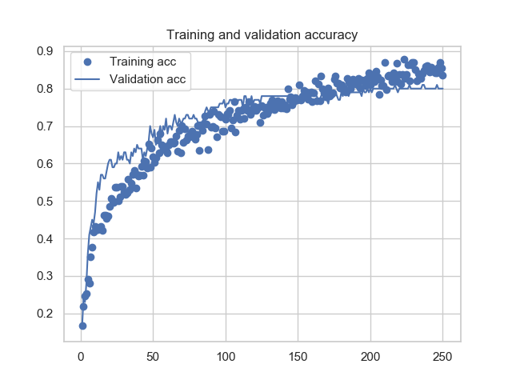

# classification-CNN-medical-Kaggle

## Classifying medical images with a convolutional neural network

### I. The dataset

I apply a convolutional neural network (CNN) to 5000 histological images of human colorectal cancer made available by
Kather JN et al (2016), and taken from the Institute of Pathology of the University of Heidelberg in Mannheim 
(https://zenodo.org/record/53169#.XFoqfs9KjOS). The images are magnified by 20x, contain 3 channels RGB
and 150x150 pixels (corresponding to 74x74 µm, 0.495 µm per pixel). 
  
The dataset contains 8 distinct classes (named 'tumor', 'stroma', 'complex', 'lympho', 'debris',
'mucosa', 'adipose' and 'empty'). Each image corresponds to one class, and each 
class contains 625 images. 

Citation: Kather JN, Weis CA, Bianconi F, Melchers SM, Schad LR, Gaiser T, Marx A, Zollner F: Multi-class texture 
analysis in colorectal cancer histology (2016)

### II. The model (VGG16 base)

I use a pre-trained VGG16 model base and add a densely connected classifier 
(DC) on top of it. In this way, it is possible to save computation time by 
using the pre-trained weights from the model base as input weights to 
the training of the data, instead of having to train the weights from scratch.

First, 'features' (predictions) are extracted from the model base by running 
the training images only once through the model base. Then, 
the resulting output is used as input to a densely connected classifier followed
by a layer of dropout regularization, which is trained on the labeled data.

-------

Recall:
 dimension1 in the last layer is 3 if Inception V3, 4 if VGG16
 dimension2                     2048 if Inception V3, 512 if VGG16

 changeable (hyper-)parameters:
nb_epochs = 300
nodes_in_lastlayer1 = 60
nodes_in_lastlayer2 = 0 #20 #500 # 300
dropout1 = 0.55
dropout2 = 0.5

model = models.Sequential()
model.add(layers.Dense(nodes_in_lastlayer1, activation='relu', input_dim=dim1 * dim1 * dim2))
model.add(layers.Dropout(dropout1))

model.add(layers.Dense(8, activation='sigmoid'))
model.compile(optimizer=optimizers.RMSprop(lr=2e-5), # optimizer could be 'adam'
              loss='categorical_crossentropy',            # loss could be 'categorical_crossentropy'
              metrics=['acc'])
history = model.fit(train_features, train_labels,
                    epochs=nb_epochs,
                    batch_size=batch_size,
                    validation_data=(validation_features, validation_labels))

 
 from which I extract the weights  and stack additional layer to   
he densely connected classifier on top of the

### III. Results: The accuracy of the model varies with different hyperparameters 

