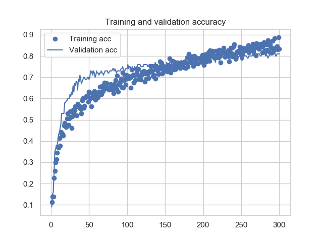

# Classifying medical images with a convolutional neural network

### I. The dataset

I apply a convolutional neural network (CNN) to the task of classifying 5000 histological images of human colorectal cancer made available by
Kather JN et al (2016), and taken from the Institute of Pathology of the University of Heidelberg in Mannheim 
(https://zenodo.org/record/53169#.XFoqfs9KjOS). The images are magnified by 20x, contain 3 channels RGB
and 150x150 pixels (corresponding to 74x74 µm, 0.495 µm per pixel). 
  
The dataset contains 8 distinct classes (named 'tumor', 'stroma', 'complex', 'lympho', 'debris',
'mucosa', 'adipose' and 'empty'). Each image corresponds to one class, and each 
class contains 625 images. 

A typical image for each of the above categories respectively looks like 

    
   

Citation: Kather JN, Weis CA, Bianconi F, Melchers SM, Schad LR, Gaiser T, Marx A, Zollner F: Multi-class texture 
analysis in colorectal cancer histology (2016)

### II. The model architecture (VGG16 base)

I use a pre-trained VGG16 model base, - that is, the fully trained VGG16 network up
 to a selected layer (the `keras` library selects this layer when the option `include_top=False` is set).

The output values of this layer forms a 4x4x512 matrix. These values are used as
_input features_ for a classifier.

In this way, it is possible to save 
computation time by using the pre-trained weights from the model base,
instead of having to train the weights from scratch.

The feature vector for the classifier is obtained by running `conv_base.predict()` on the input image,
 using the VGG16 model base.
 
The classifier contains a densely connected hidden layer of size `L1`
(the size `L1` is a hyperparameter), using Relu activation function,
with dropout regularization.
After the hidden layer, the last densely connected classifier layer (using a sigmoid 
function) has 8 nodes and outputs the 8 categories of data.

Dropout regularization threshold for the hidden layer is another hyperparameter.

For the optimization, an RMSprop is used as optimizer and a categorical crossentropy 
as loss function.

The dataset of 5000 images is distributed evenly over the 8 classes, so that each class 
contains 625 images. For each class, the images are split into 425 training, 100 
validation and 100 test images.  

I vary the number of nodes in the densely connected classifier as well as the dropout 
regularization threshold.  

|  fixed features of the CNN |  |
|----- |-----   | 
|  total nb of images (per class)|   625     |
|  nb of training images (per class)|  425      |
|  nb of validation images (per class)|  100    |
|  nb of test images (per class)|  100    |
|  nb of images per batch (for validation) | 25      |
| nb of epochs  |  250     |

|  hyperparameters |  |
|----- |-----   | 
| nb of nodes   | 50, 55, 60 |
| dropout threshold   | 0.5, 0.55, 0.60 |

 

### III. Results: The accuracy of the model varies with different hyperparameters 

The following figures show the accuracy of the CNN as a function of time epochs for the 
training set (blue dots) vs the validation set (blue line).
Figures 1a-c) illustrate runs made using 50 (a),55 (b) and 60 (c) nodes (in the densely 
connected layer) for a dropout probability of 0.5. 

Although each realization of a run has a very slightly different outcome (because of 
stochastic parts in the model, not shown here) these figures are a good representation 
of the respective hyperparameter settings of the present CNN.

For a dropout parameter of 0.5 (Figures 1a-c), I achieved the best result (highest accuracy over time) 
using 55-60 nodes. With 50 nodes, the accuracy stagnates below a value of 0.8, while using 55 or 60 nodes 
slightly increases the accuracy up to ~ 0.81-0.83. More than 60 nodes tend again to decrease
the accuracy of the network.        

###### 1a) Using 50 nodes and a dropout probability of 0.5 

###### 1b) Using 55 nodes and a dropout probability 0.5 

###### 1c) Using 60 nodes and a dropout probability 0.5 

For all figures a)-c), there is an overfitting of the training accuracy (dots) after epoch 150.
This overfitting can be 'delayed' in time by increasing the dropout probability, at the cost of 
accuracy.

###### 2a) Using 50 nodes and a dropout probability of 0.55 

###### 2b) Using 55 nodes and a dropout probability 0.55 

###### 2c) Using 60 nodes and a dropout probability 0.55 

### IV. Scripts

The script `create_folders.py` creates the working (training, validation and test) directories
(using the class CreateFolders) if they do not yet exist or reads in the images from the 
directories if they already exist. 

Run the script `project2.py` to 
1) call the class CreateFolders 
2) instantiate the VGG16 model base 
3) extract the features from the pretrained model using `conv_base.predict()`
4) define and train the densely connected classifier and train it on the labeled data
5) plot the accuracy as a function of time 

After running `project2.py`, a .png file such as `Accuracy_VGG16_....` will be created, 
showing the graph.

Remark: The present images - available on the Kaggle website - used for this CNN 
have a low resolution (150x150 pixels). Unfortunately, no images with higher resolution are 
available. The classification performance of the convolutional neural network might be increased
by using images of higher resolution.

An example of a 1000x1000 would look like this:   

 

### Acknowledgements

Thank you to JN Kather for making the dataset of colon carcinoma images available.